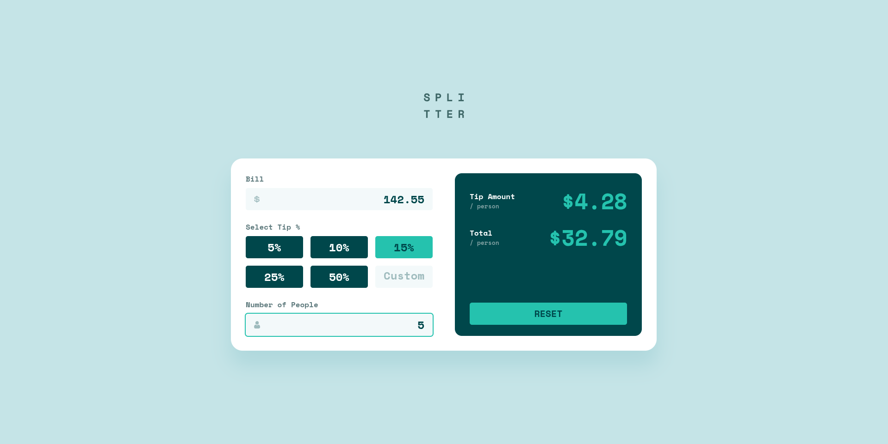

# Frontend Mentor - Tip calculator app solution

This is a solution to the [Tip calculator app challenge on Frontend Mentor](https://www.frontendmentor.io/challenges/tip-calculator-app-ugJNGbJUX). Frontend Mentor challenges help you improve your coding skills by building realistic projects.

## Table of contents

- [Overview](#overview)
  - [The challenge](#the-challenge)
  - [Screenshot](#screenshot)
  - [Links](#links)
- [My process](#my-process)
  - [Built with](#built-with)
  - [What I learned](#what-i-learned)
  - [Continued development](#continued-development)
- [Acknowledgments](#acknowledgments)

## Overview

### The challenge

Users should be able to:

- View the optimal layout for the app depending on their device's screen size
- See hover states for all interactive elements on the page
- Calculate the correct tip and total cost of the bill per person

### Screenshot



### Links

- Solution URL: [GitHub](https://github.com/async-kita/tip-calculator-app)
- Live Site URL: [GitHub Pages](https://async-kita.github.io/tip-calculator-app/)

## My process

### Built with

List the technologies and approaches you used. For your project, these might include:

- Semantic HTML5 markup
- CSS custom properties (variables)
- Flexbox & CSS Grid for layout
- Mobile-first workflow
- Vanilla JavaScript (ES6+ classes)
- Custom form validation
- inputmode="decimal" for better mobile UX
- Accessible focus states and ARIA labels

### What I learned

This section is your chance to reflect on key takeaways. For instance:

#### Form Validation and Error Handling

You implemented a `validation` method that checks if fields are empty or zero, toggles error classes, and resets the state. This taught you how to manage form state in real time and provide immediate visual feedback.

#### Active State Management for Tip Buttons

The `onClickButtonPercent` method ensures only one tip button is active at a time by toggling the `is-active` class and updating the tip percentage accordingly—a pattern you can reuse for any button group.

#### CSS Grid for Responsive Layouts

Using CSS Grid, you created a layout that switches from a single column on mobile to two columns on desktop. The `clamp()` function helped create fluid spacing:

```css
input[type="number"] {
  -moz-appearance: textfield;
}
input::-webkit-outer-spin-button,
input::-webkit-inner-spin-button {
  -webkit-appearance: none;
  margin: 0;
}
```

### Continued development

Identify areas you want to improve in future projects. For example:

- **_Custom Input Edge Cases_**: The custom tip input currently accepts any number. You want to implement a maximum tip percentage (e.g., 100%) and better handle non-numeric input.
- **_Accessibility Improvements_**: Add more ARIA roles and screen-reader announcements for dynamic updates (e.g., “Tip amount per person updated to $4.50”).
- **_Keyboard Navigation_**: Ensure full keyboard navigability, including focus trapping within the form.
- **_Testing_**: Consider adding unit tests for the calculation logic using a testing framework like Jest.

## Acknowledgments

Thank you to the Frontend Mentor community for their valuable feedback and to the creators of the design files for the inspiration. A special shout-out to the developers who shared their solutions—your work helped me discover alternative approaches to common problems.
